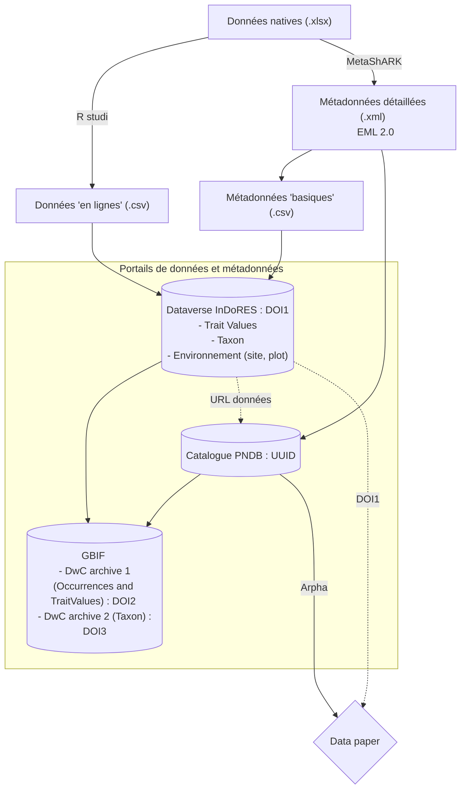

# The FAIRTrait database

This repository contains the code used for the article "FAIRTraits: a semantically enriched data base of plant traits from Mediterranean populations of 242 species".

You can clone the repository with git by pasting in your terminal:

	git clone https://src.koda.cnrs.fr/cefe/fairtraits.git
    
or 
just download the repository:
[FAIRTraits](https://src.koda.cnrs.fr/cefe/fairtraits/archive/master.zip).

If you have [Rstudio](https://www.rstudio.com/) installed on your computer, you can then open `FAIRTraits.Rproj` with Rstudio.

You can contact me at <leo.delalandre@cefe.cnrs.fr> or <leo.delalandre@protonmail.com>

# Data processing

# Structure of the project repository

## data
Contains raw data (in excel and csv format). They can be dowloaded with your Janus identifier from [MyCore](https://mycore.core-cloud.net/index.php/apps/files/?dir=/DataPaper_ECOPAR/data/raw&fileid=3059273178). 

## output
Contains the processed data, formatted for different purposes

## scripts
